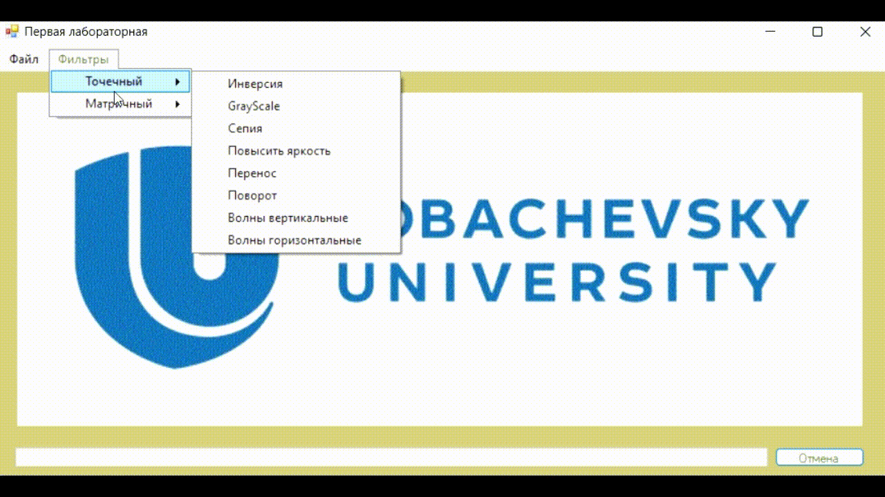

## Лабораторные работы по курсу "Компьютерная графика"

**Лабораторная работа №1. Обработка изображений**

Обработка изображений матричными и точечными фильтрами. Программа позволяет использовать базовые фильтры обработки изображения: сепия, grayscale, motion blur, инверсия, 
фильтр Гаусса, повороты, переносы, волны и тиснение и тд.

